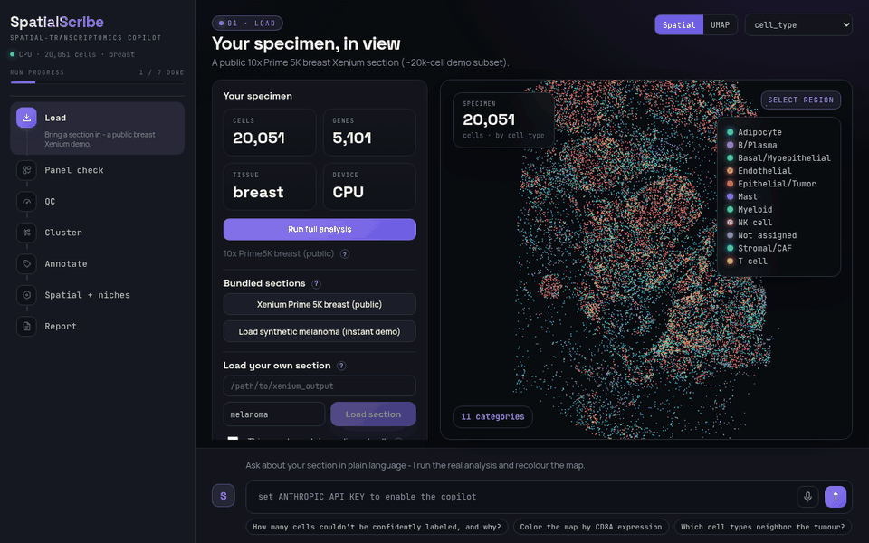
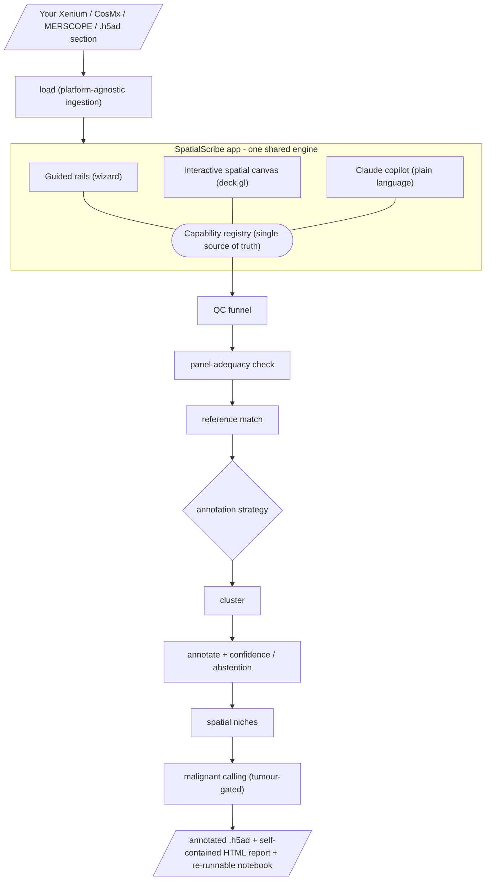
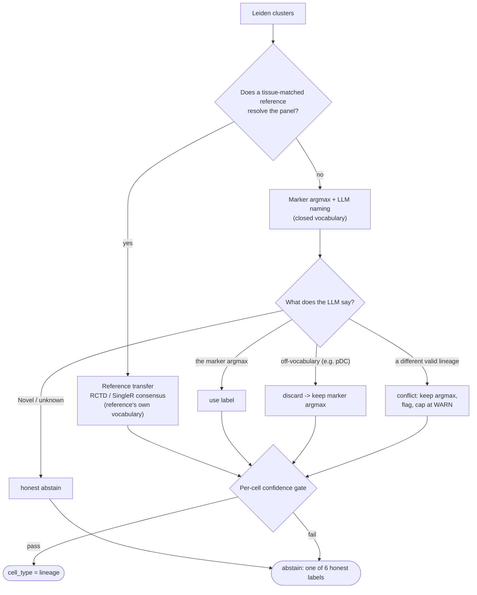

# SpatialScribe

**A fast, self-serve spatial-transcriptomics analysis copilot for wet-lab scientists.**

You ran a Xenium (or CosMx / MERSCOPE) experiment and got your data back. SpatialScribe takes
you from raw output to annotated cell types, spatial insight, and a shareable report - in plain
language, without a terminal or R, and without waiting for a bioinformatician. Built for the
[Built with Claude: Life Sciences](https://cerebralvalley.ai/e/built-with-claude-life-sciences)
hackathon.

<p align="center">
  
</p>

<p align="center"><em>Load a section, run the analysis, then hover a cell type - those cells light up across the tissue.</em></p>

## What it does

A three-pane web app (React + FastAPI + deck.gl) over one shared analysis engine:

- **Guided rails** - a wizard walks you through Load -> Panel check -> QC -> Cluster -> Annotate ->
  Spatial exploration -> Report, with smart defaults and a plain-language explanation (and the exact
  code) at every step.
- **One-click full run** - or skip the wizard: **Run full analysis** runs the whole spine as one
  background job and opens a fully-analyzed section.
- **Interactive spatial canvas** - box-select a region to QC it or exclude it; click a cell type
  to subcluster it into subtypes; **hover a cell type to highlight where it sits in the tissue**.
- **Claude copilot** - ask questions in plain English ("are the T cells excluded from the tumor?")
  and it runs the real analysis and answers, grounded in the numbers - it can even recolor the
  canvas for you.

### Highlights

- **Panel-adequacy check** - tells you which cell types your panel actually can and cannot resolve,
  *before* you over-trust an annotation.
- **Honest confidence + abstention** - a multi-layer annotation-QC funnel (segmentation, a
  panel-indexed count floor, contamination/purity, panel adequacy, subsampling stability, spatial
  coherence) fused into a per-cell confidence call that **abstains rather than emit a confident
  wrong label**.
- **Multi-method annotation** - marker scoring + Claude, reconciled to a consensus with confidence
  and flagged disagreements; optional reference transfer (RCTD / SingleR / scANVI / TACCO) when a
  matched reference is available.
- **Tumor & program discovery** - marker-based malignant calling (optional CNV / Cancer-Finder
  paths) and de-novo NMF gene programs, both wired into the copilot.
- **Fast & scalable** - GPU-accelerated (rapids-singlecell) with a CPU fallback; scales to
  10^5-10^6 cell sections.
- **Reproducible** - exports an annotated `.h5ad`, a self-contained HTML report, and a re-runnable
  notebook that regenerates the whole analysis.

## Quickstart

The fastest path is Docker - one command, then open your browser:

```bash
git clone https://github.com/p-gueguen/spatial-scribe && cd spatial-scribe
export ANTHROPIC_API_KEY=sk-...          # optional: without it the app runs, the copilot is disabled
docker compose up                        # builds + serves on http://localhost:8000
```

Open **http://localhost:8000** and click **"Load synthetic demo (instant)"** - always works, no
data files, no GPU. Or **"Load breast example"** for the bundled public Xenium Prime 5K section.

<details>
<summary>Run without Docker (pixi or pip)</summary>

```bash
# Option A - pixi (manages the scanpy/squidpy stack)
pixi install -e main
PYTHONPATH=.:src pixi run python -m uvicorn backend.app:app --port 8000   # backend
cd webapp && npm install && npm run dev                                   # frontend (vite :5173 -> proxies /api)

# Option B - pip into your own environment
pip install "spatial-anno-metrics @ git+https://github.com/p-gueguen/spatial-anno-metrics"
pip install -e .
PYTHONPATH=.:src python -m uvicorn backend.app:app --port 8000
cd webapp && npm install && npm run build   # then the backend serves webapp/dist single-origin on :8000
```

Runs CPU-only out of the box (`export SPATIALSCRIBE_FORCE_CPU=1` to force it). GPU is optional
(install `rapids-singlecell` on a CUDA node; the backend auto-detects, else CPU). See
[docs/QUICKSTART.md](docs/QUICKSTART.md) and [docs/USER_GUIDE.md](docs/USER_GUIDE.md).
</details>

### Bring your own LLM

The copilot is endpoint-agnostic: **Anthropic** by default, or any **OpenAI-compatible `/v1`
server** (a local vLLM, OpenAI, ...):

```bash
export ANTHROPIC_API_KEY=sk-...                       # Anthropic (default; ANTHROPIC_MODEL to override)
# or:
export SPATIALSCRIBE_LLM_BASE_URL=http://localhost:8000/v1 \
       SPATIALSCRIBE_LLM_MODEL=<model-id> SPATIALSCRIBE_LLM_API_KEY=<key>
```

**Your data never leaves your machine** - the analysis runs locally; only your plain-language
question and the computed numbers are sent to the LLM.

## How it works

SpatialScribe is one engine driven three ways. The rails, the canvas, and the copilot all call the
**same capability registry**, so the guided flow and the chat can never diverge:



The same spine runs headless - one command, folder to report:

```bash
python scripts/run.py --demo --out results/                                   # synthetic, no data needed
python scripts/run.py --path <run_dir_or.h5ad> --tissue "human breast" --out results/
```

### How a label is earned (or abstained)

Every cell type is *computed*, never asserted. Coarse lineages are assigned per Leiden cluster; an
LLM may *name* a cluster inside a closed vocabulary but can never invent a label or overrule the
marker evidence; and a per-cell confidence gate abstains instead of guessing. When a tissue-matched
reference is available, the flow routes to supervised reference transfer instead.



Full rationale (each branch fixed a real bug and is pinned by a test):
[docs/ANNOTATION_SCHEME.md](docs/ANNOTATION_SCHEME.md).

## Drive it from an agent (Claude-native)

SpatialScribe is built to be operated by Claude, not just by a human clicking:

- **Bundled skill** - [`.claude/skills/spatialscribe/`](.claude/skills/spatialscribe/) teaches a
  Claude Code agent to drive the whole engine (headless run, the copilot, the panel/QC/reference
  checks) grounded in the computed numbers. It works on your own data, compute, and key.
- **HTTP API** - the FastAPI backend exposes a small, documented REST surface (load a section, run
  any capability, ask the copilot, recolor the map). Any agent can drive it by `curl`. See
  [docs/API.md](docs/API.md).

## Demo dataset

Public, CC BY 4.0: [10x FFPE Human Breast (Xenium Prime 5K)](https://www.10xgenomics.com/datasets),
shipped downsampled at `data/demo_public.h5ad`. An instant synthetic melanoma section is
built in and needs no data at all. See [docs/DATASETS.md](docs/DATASETS.md).

## Methods & evidence base

SpatialScribe's QC and annotation logic is grounded in a documented, cited evidence base (a
literature + adversarial-verification research pass), not ad-hoc defaults. The annotation-quality
scores are computed through the standalone
[`spatial-anno-metrics`](https://github.com/p-gueguen/spatial-anno-metrics) package. Start with
[docs/research/cell-annotation-qc.md](docs/research/cell-annotation-qc.md) and
[docs/research/annotation-method-selection.md](docs/research/annotation-method-selection.md).

## Project layout

| Path | What |
|------|------|
| `src/spatialscribe/analysis/` | The engine - pure functions behind one capability registry |
| `backend/` | Thin FastAPI over the same registry (`/api`) |
| `webapp/` | React + Vite + deck.gl single-page app |
| `subprocesses/` | Isolated out-of-env runners (RCTD / SingleR / scANVI / CNV / ovrlpy / ...) |
| `docs/` | Architecture, user guide, and the cited research evidence base |
| `.claude/skills/spatialscribe/` | The agent skill |
| `tests/` | The test suite |

See [docs/ARCHITECTURE.md](docs/ARCHITECTURE.md) and [CONTRIBUTING.md](CONTRIBUTING.md).

## Credits & license

SpatialScribe orchestrates a lot of open-source science (scanpy, squidpy, CellTypist, TACCO, RCTD,
SPLIT, deck.gl, ...) and a public 10x CC-BY demo section - see [CREDITS.md](CREDITS.md).

MIT. Built with [Claude Code](https://claude.com/claude-code).
